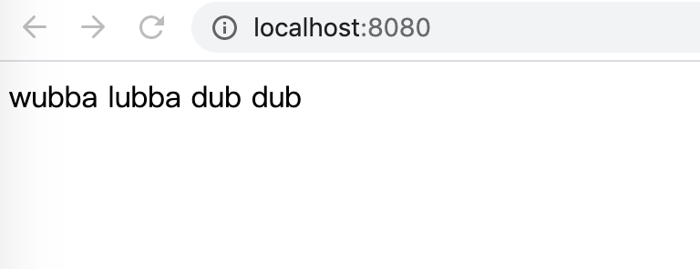

# spring-docker-example
A Spring Docker Example for SE2021 honor class at fdu.

# Steps for running this project

```
git clone https://github.com/Humbertzhang/spring-docker-example
cd spring-docker-example
mvn clean package
docker build .
```
When you see 
```
Successfully built <image-id>
```
run:
```
docker run -p 8080:8080 <image-id>
```

Open your browser, type `http://localhost:8080/` in the address bar, and type Enter.

You will see 



# Something maybe useful

[Maven入门教程](https://cloud.tencent.com/developer/article/1381622)

[Maven环境配置](https://www.runoob.com/maven/maven-setup.html)

[Maven基础知识](https://www.imooc.com/wiki/mavenlesson/mavenintroduction.html)

